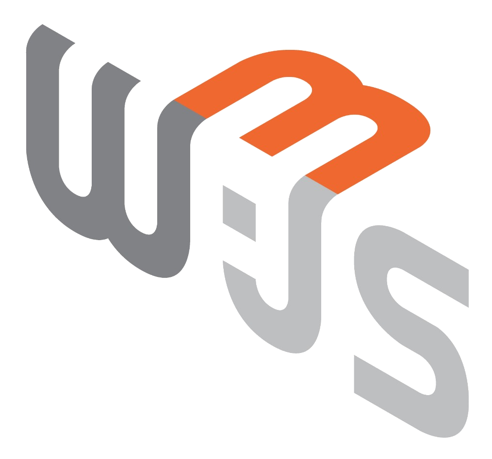
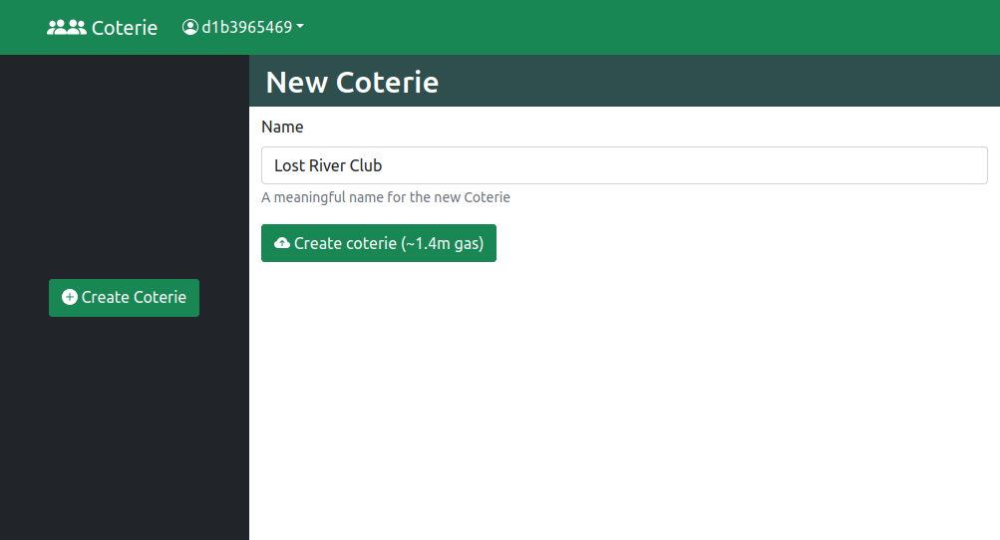
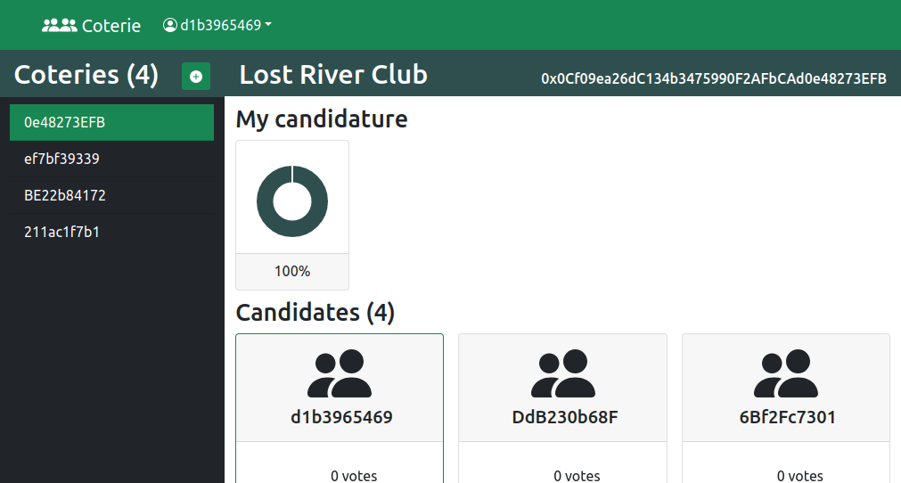
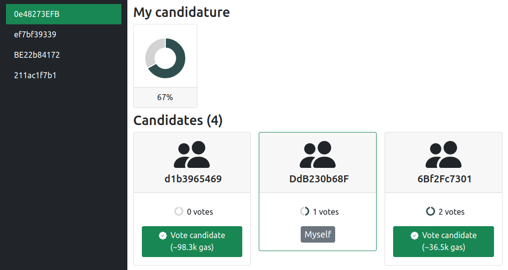
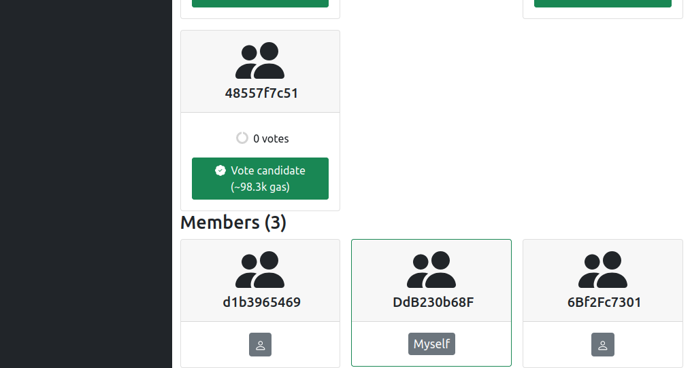
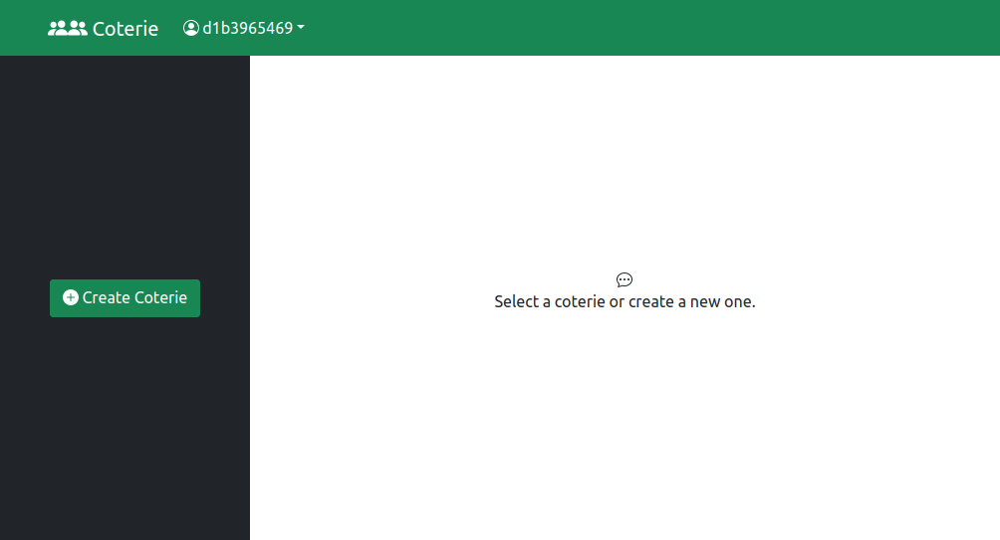
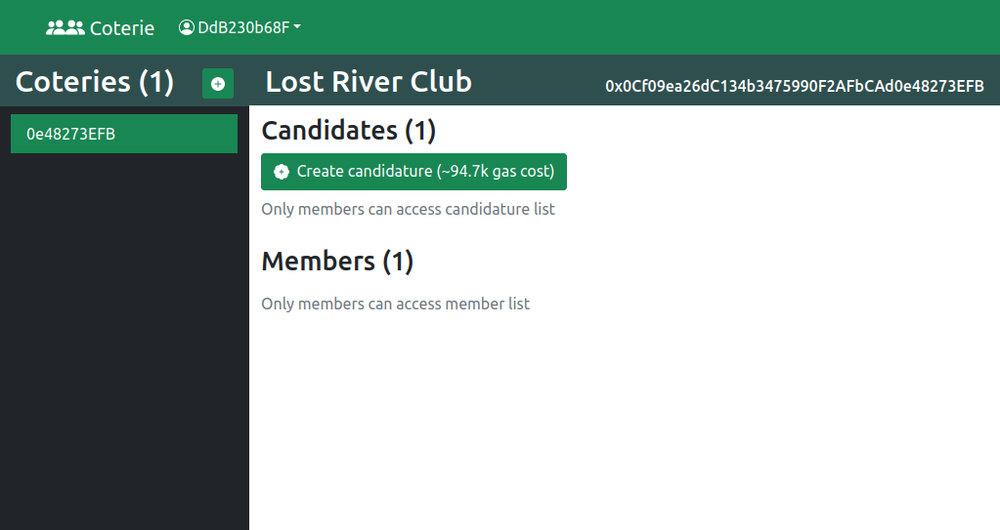
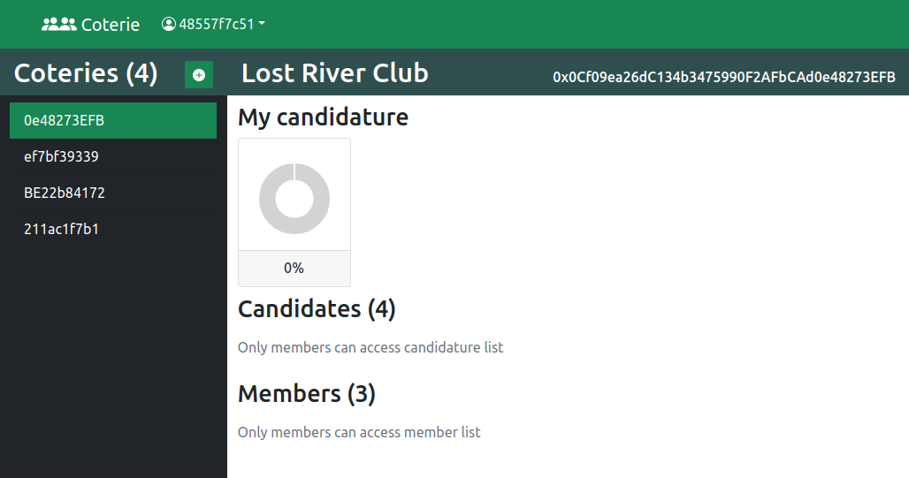
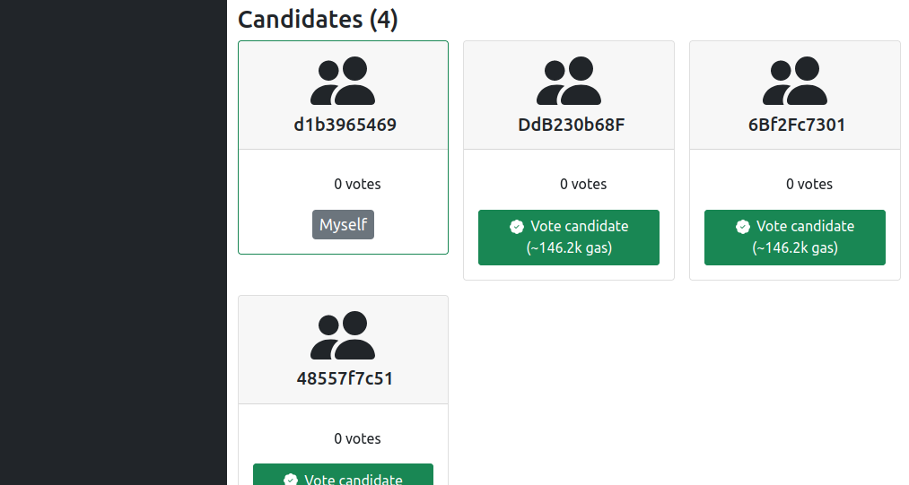

# Coterie dApp

<div style="display: flex; flex-direction: row; align-items: center; padding: 20px 0;">
 Ethereum
 Truffle
 Ganache
 Solidity
 Web3.js
 React
 Bootstrap
</div>
  

Create democratic communities on the Ethereum blockchain.







## Features

* Smart Contract based Coterie and candidature creation
* Candidature voting
* Coterie, candidatures and members listing


## Usage



### Create a new Coterie


### Create a candidature 



### Wait for votes



### Check my candidature


### Check and vote candidatures


### List members


### Vote candidate




## Development

### Environment

Install:

* [Node.js](https://nodejs.org/en/download/)
* [Yarn](https://classic.yarnpkg.com/en/docs/install)
* Metamask plugin for your Browser (Optional):
    * [Firefox plugin](https://addons.mozilla.org/en-US/firefox/addon/ether-metamask/)
    * [Chrome plugin](https://chrome.google.com/webstore/detail/metamask/)

### Recomended plugins to develop with Visual Studio Code

* [Ethereum Solidity Language for Visual Studio Code
](https://marketplace.visualstudio.com/items?itemName=JuanBlanco.solidity)

### Install dependencies

```sh
yarn install
(cd client; yarn install)
```

### Compile

```sh
yarn compile
```

### Migrate

```sh
# start ganache network
yarn network
# run migrations
yarn migrate
```

### Test

```sh
# start ganache network
yarn network
```
```sh
# run all tests
yarn test
# run only a specific file
yarn test test/Coterie.test.js
# run only tests matching regex
yarn test -g "should have a candidature"
```

### Run frontend

1. prepare ganache network:

```sh
yarn network
yarn compile
yarn migrate
```

2. Run frontend:

```sh
cd client
yarn start
```

3. Connect Metamask using the secret recovery phrase from the console output of Ganache to import accounts.

